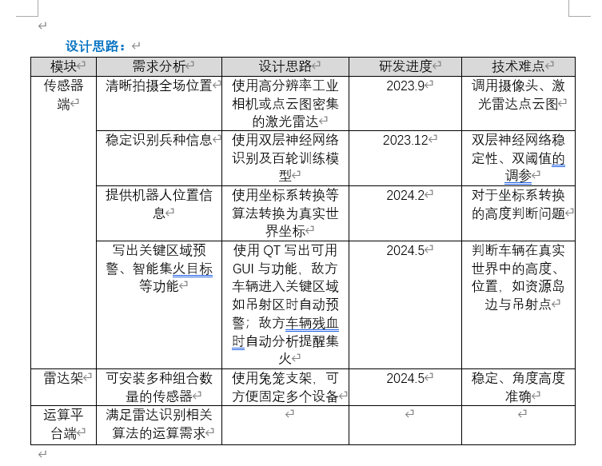
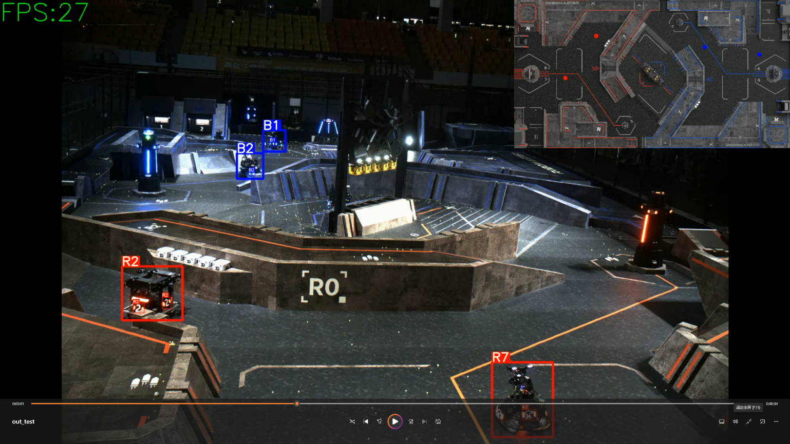
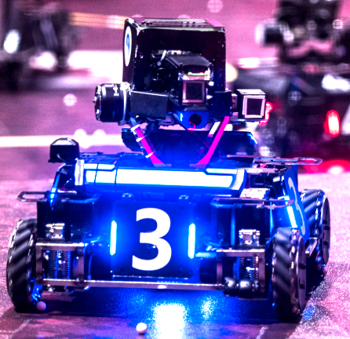
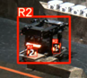
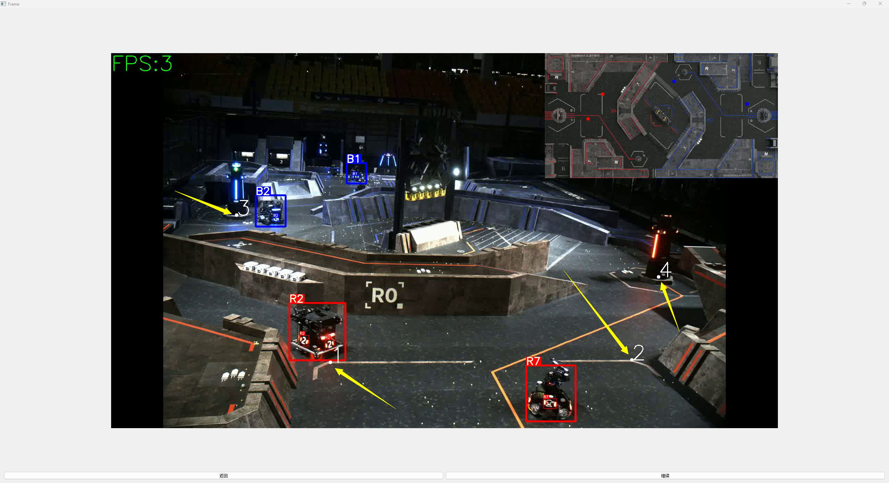
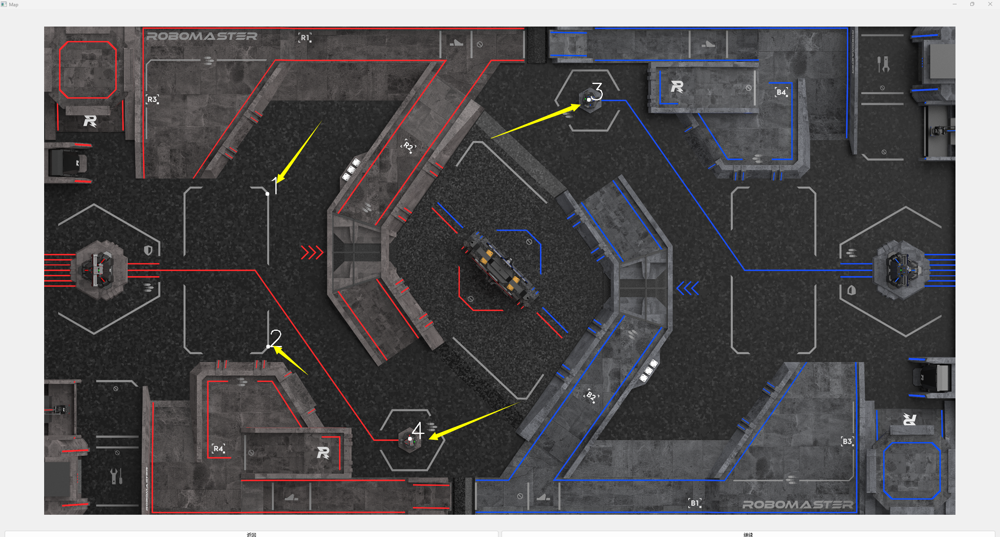
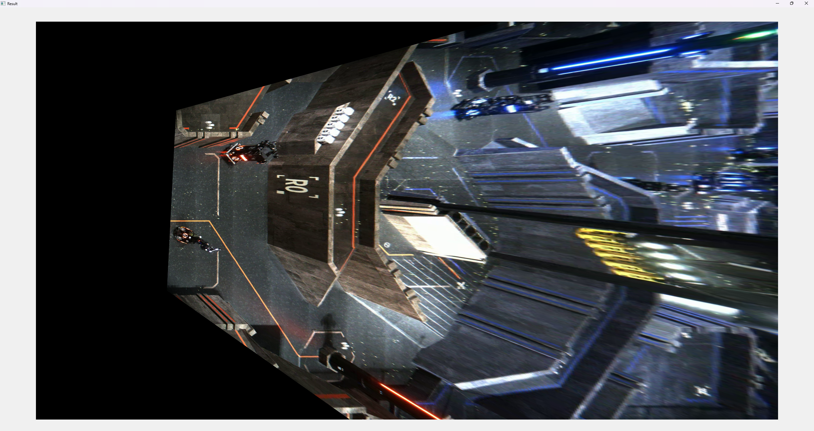

福建师范大学Pikachu战队2024Robomaster雷达组源码

仅需单目摄像头即可实现雷达识别追踪功能

TOP10 二等奖 很满足 燃尽啦

---

这是为Robomaster比赛中雷达组设计的程序，其目的是实现依靠俯瞰全场的单目工业相机的实时视频流，识别敌我双方车辆、定位敌我双方车辆在地图坐标系的坐标点位，并将每辆车辆的实时坐标点位通过串口通信回传给比赛方。设计思路如下：

运行时ui如下：

**YOLO车辆识别功能实现：**

在比赛中，车辆由车上灯条分为红蓝两队，再由车四周的四个带有数字的装甲板确定车辆编号。我们需要做的是识别出敌我车辆，再根据数字确定车辆型号。

首先从视频源读取一帧画面，将整帧图像送入车辆检测模型，得到所有车辆的边界框，再对每个边界框内的车辆首先进行敌我识别，在ui上输出第一层边界框，即为图中外侧大框。

再对边界框中图像送入第二层神经网络，即为装甲板检测模型，在此小图中识别装甲板上的数字，以此确定车辆编号。

**二维定位功能实现：**

首先加载视频源，选择第一帧图片，并在此图中通过鼠标点击选择四个源点，即图中黄色箭头所指的四个点为用户通过鼠标自定义的点

然后加载一张预设的2D场地地图，让用户在地图上点击与上一步完全对应的目标点，即图中黄色箭头所指的四个点

记录下两次点击的点位的xy坐标，通过cv2.findHomography(srcArr,
dstArr)函数，根据两组点计算出变换矩阵，然后应用这个矩阵，生成映射后的预览图

最后取刚才识别到的车辆边界框中点作为车辆坐标，将坐标应用刚才的矩阵，映射得到新的坐标，以此作为车辆在地图坐标系中的坐标。
